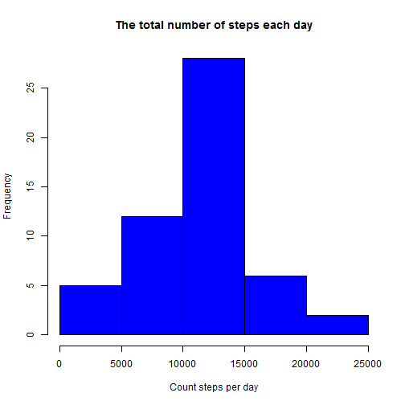
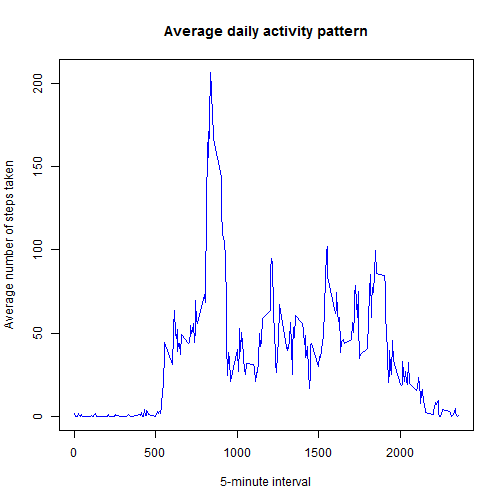
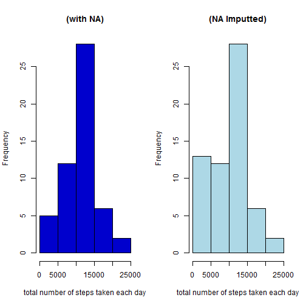
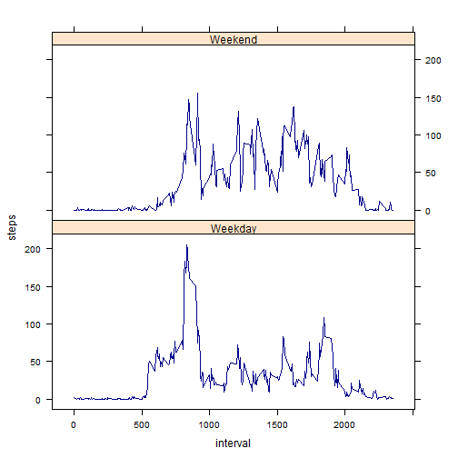

##Introduction##
Now,it is possible to collect a large amount of data about personal 
movement using activity monitoring devices such as a **Fitbit**, **Nike Fuelband**, or **Jawbone Up**. These type of devices are part of the 
**"quantified self" movement** - a group of enthusiasts who take 
measurements about themselves regularly to improve their health, to
find patterns in their behavior, or because they are tech geeks.

But these data remain under-utilized both because the raw data are hard
to obtain and there is a lack of statistical methods and software for
processing and interpreting the data.  

This assignment makes use of data from a personal activity monitoring
device,which collects data at 5 minute intervals through out the
day. The data consists of two months of data from an anonymous
individual collected during the months of October and November, 2012
and include the number of steps taken in 5 minute intervals each day.

**The assignment listed many questions,so I track these questions and give my answers through this report.**

The data for this assignment can be downloaded from **Coursera website.** The link is:

https://d396qusza40orc.cloudfront.net/repdata%2Fdata%2Factivity.zip


Dataset: **Activity monitoring data [52K]**

The **variables** included in this dataset are:

**1.Steps:** Number of steps taking in a 5-minute interval (missing
values are coded as NA)


**2.Date:** The date on which the measurement was taken in YYYY-MM-DD
format


**3.Interval:** Identifier for the 5-minute interval in which
measurement was taken.


The dataset is stored in a **comma-separated-value (CSV) file** and
there are a total of **17,568 observations** in this dataset. 


**Setting Environment**

```r
library(markdown)
library(knitr)
library(lattice)
sessionInfo()
```

```
## R version 3.2.2 (2015-08-14)
## Platform: x86_64-w64-mingw32/x64 (64-bit)
## Running under: Windows 7 x64 (build 7601) Service Pack 1
## 
## locale:
## [1] LC_COLLATE=English_United Kingdom.1252 
## [2] LC_CTYPE=English_United Kingdom.1252   
## [3] LC_MONETARY=English_United Kingdom.1252
## [4] LC_NUMERIC=C                           
## [5] LC_TIME=English_United Kingdom.1252    
## 
## attached base packages:
## [1] stats     graphics  grDevices utils     datasets  methods   base     
## 
## other attached packages:
## [1] lattice_0.20-33 markdown_0.7.7  rmarkdown_0.8.1 knitr_1.11     
## 
## loaded via a namespace (and not attached):
##  [1] magrittr_1.5      rsconnect_0.4.1.4 formatR_1.2.1    
##  [4] htmltools_0.2.6   tools_3.2.2       yaml_2.1.13      
##  [7] stringi_1.0-1     grid_3.2.2        stringr_1.0.0    
## [10] digest_0.6.8      evaluate_0.8
```

**Loading and preprocessing the data**

 1. Load the data
 

```r
activity <- 
    read.csv("C:/Users/sahera/Documents/GitHub/RepData_PeerAssessment1/activity.csv")
```
 2. Explore the data


```r
str(activity)
```

```
## 'data.frame':	17568 obs. of  3 variables:
##  $ steps   : int  NA NA NA NA NA NA NA NA NA NA ...
##  $ date    : Factor w/ 61 levels "2012-10-01","2012-10-02",..: 1 1 1 1 1 1 1 1 1 1 ...
##  $ interval: int  0 5 10 15 20 25 30 35 40 45 ...
```

```r
summary(activity)
```

```
##      steps                date          interval     
##  Min.   :  0.00   2012-10-01:  288   Min.   :   0.0  
##  1st Qu.:  0.00   2012-10-02:  288   1st Qu.: 588.8  
##  Median :  0.00   2012-10-03:  288   Median :1177.5  
##  Mean   : 37.38   2012-10-04:  288   Mean   :1177.5  
##  3rd Qu.: 12.00   2012-10-05:  288   3rd Qu.:1766.2  
##  Max.   :806.00   2012-10-06:  288   Max.   :2355.0  
##  NA's   :2304     (Other)   :15840
```

3. Process/transform the data


```r
activity$date <- as.Date(activity$date, format = "%Y-%m-%d")
clean_data <- activity[which(activity$steps != "NA"), ]
```

**Q1. What is the mean total number of steps taken per day?**


```r
totalDailySteps <- aggregate(steps ~ date, data = clean_data,
                             FUN="sum")
```

**Q2. Make a histogram of the total number of steps taken each day.**


```r
hist(totalDailySteps$steps,main="The total number of steps each day",
xlab="Count steps per day", col="blue")
```

 

**Q3. Calculate and report the mean and median total number of steps
taken per day.**


```r
mean_totalDailySteps = mean(totalDailySteps$steps)
mean_totalDailySteps
```

```
## [1] 10766.19
```

```r
median_totalDailySteps = median(totalDailySteps$steps)
median_totalDailySteps
```

```
## [1] 10765
```

**Q4.What is the average daily activity pattern?**


```r
avg_steps_per_interval<- aggregate(steps~interval,data=
                                       clean_data,FUN="mean")
```

**Q5. Make a time series plot (i.e. type = "l") of the 5-minute
interval (x-axis) and the average number of steps taken, averaged
across all days (y-axis)**


```r
plot(avg_steps_per_interval, type="l",
main="Average daily activity pattern",
xlab="5-minute interval",
ylab="Average number of steps taken",
col = "blue")
```

 


**Q6. Which 5-minute interval, on average across all the days in the dataset,contains the maximum number of steps?**


```r
which.max(avg_steps_per_interval$steps)
```

```
## [1] 104
```

##Imputing missing values##

 **1. Calculate and report the total number of missing values in the dataset(i.e. the total number of rows with NAs)**
 

```r
sum(is.na(data))
```

```
## Warning in is.na(data): is.na() applied to non-(list or vector) of type
## 'closure'
```

```
## [1] 0
```
**2. Devise a strategy for filling in all of the missing values in the dataset.The strategy does not need to be sophisticated. For example, you could use the mean/median for that day, or the mean for that 5-minute interval, etc.**

  **My Strategy is to fill in the missing (NA) values creating a new dataset that is equal to the original dataset but with the missing data filled in with the median of that 5 minute interval.** 


```r
new_data <- activity
for(i in 1:nrow(new_data))
 {
  if (is.na(activity$steps[i])){
     interval.N <- activity$interval[i]
     new_data$steps[i]=
     median(activity$steps[activity$interval==interval.N],na.rm=TRUE)

}
}
```

**3. Make a histogram of the total number of steps taken each day and Calculate and report the mean and median total number of steps taken per day. Do these values differ from the estimates from the first part of the assignment?**


```r
new_totalDailySteps <- aggregate(steps ~ date, data = new_data,
                                 FUN="sum")
par(mfrow=c(1,2))
hist(totalDailySteps$steps,
main = "(with NA)",
xlab = "total number of steps taken each day", col = "blue3")
hist(new_totalDailySteps$steps,
main = "(NA Imputted)",
xlab = "total number of steps taken each day", col= "light blue")
```

 
 
**4. Calculate and report the mean and median total number of steps taken per day with new data.**


```r
new_mean_totalDailySteps = mean(new_totalDailySteps$steps)
new_mean_totalDailySteps
```

```
## [1] 9503.869
```

```r
new_median_totalDailySteps = median(new_totalDailySteps$steps)
new_median_totalDailySteps
```

```
## [1] 10395
```

**5. Diff mean and median of total daily steps**


```r
diff_mean <- new_mean_totalDailySteps - mean_totalDailySteps  
diff_median <- new_median_totalDailySteps - median_totalDailySteps   
```

**6. What is the impact of imputing missing data on the estimates of the total daily number of steps?**


```r
total_steps1 <- sum(clean_data$steps)
total_steps2 <- sum(new_data$steps)
diff_total <- total_steps2 -total_steps1 []
```

**The diffrence in total daily number of steps is 9128 .Mean values with imputing missing data is -1262.3198268 , median value is -370 and histograms above show the difference between data with NA and data with NA imputed.** 

**7. Are there differences in activity patterns between weekdays and weekends?**

 7.1 Create a new factor variable in the dataset with two levels: "weekday" and "weekend" indicating whether a given date is a weekday or weekend day.
 
So,I added two new columns to the new_data. First: the **dayName**  indicate the name of the day, in which the observations were recorded. Second: the **dayType**  a factor variable with two values: weekday or weekend.


```r
new_data$dayName <- weekdays(new_data$date)
new_data$dayType <- as.factor(ifelse(new_data$dayName %in%
c("Saturday","Sunday"),"Weekend","Weekday"))
```

 7.2 Make a panel plot containing a time series plot (i.e. type = "l") of the 5-minute interval (x-axis) and the average number of steps taken, averaged across all weekday days or weekend days (y-axis). 
 The plot should look something like the following, which was creating using simulated data:


```r
stepsPerInterval_dayType=aggregate(steps ~ interval+ dayType, data=new_data,
FUN="mean")
xyplot(steps ~ interval|dayType,data=stepsPerInterval_dayType, layout = c(1, 2),
type="l", par.settings = simpleTheme(col = "Dark blue"))
```

 

**The plot shows high levels of activity in weekdays morning then the activity slow down to rise very little in the evening. However, during weekend the average of activity is consistent with a little high level in the morning.**

**Refrence:**
For more information on the Data Science Specialization and the Reproducible Research course, please see:

https://www.coursera.org/course/repdata
